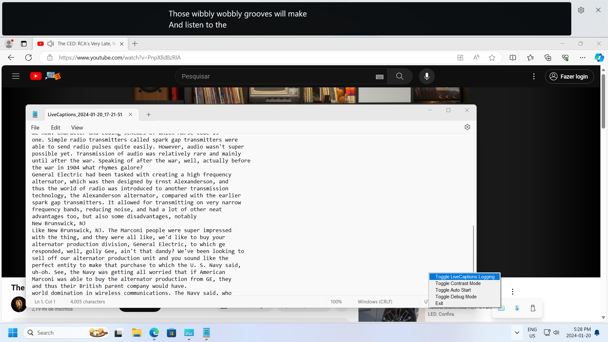

# LiveCaptionsLogger

This software was developed as a response to [this Microsoft Forums question](https://answers.microsoft.com/en-us/windows/forum/all/is-it-possible-to-save-a-transcript-of-live/3474cc04-1d34-4e51-bf99-aa7dc0e0fdd0)

Windows 11 offers a very good accessibility option called Live Captions, however, Microsoft does not offer a way for users to log a transcript of what the live captions are generating at a given moment,
those transcripts could be useful for users in a number of ways, but due to the closed source nature of Windows we would have to wait for Microsoft to come up with a solution for this, if ever.

Enter this attempt at providing rudimentary support for live caption transcriptions.

This small Java software relies on [Tesseract OCR](https://github.com/tesseract-ocr/tesseract) to perform an OCR (Optical Character Recognition) of the usual live captioning area at each second.\
We then apply some filtering to make sure we only write down the finalized line after Windows is done generating it.\
The lines are then written to the LiveCaptions folder inside your Documents library, each time the captions window goes away a new log file is generated.

# Installation

You need to have Java 11 or newer to run this program, we recommend installing the Eclipse Temurin OpenJDK implementation:\
[Eclipse Temurin](https://adoptium.net/temurin/releases/)\
For Windows 11, scroll down and select the x64 JRE .msi, download and install it

Then, clone or download this repository (Github > Code > Download ZIP).\
Copy or extract the contents to any directory you'd like this program to run from.\
We already provide a pre-compiled JAR of the program, so now you can just run the 'start.bat' script to start the program.

Right click the tray icon to setup auto start or toggle transcriptions on and off.
